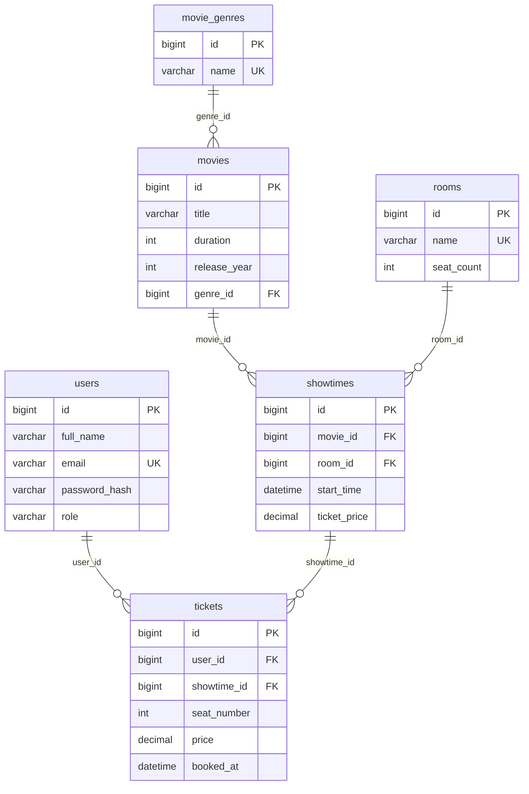

# ERD — Movie Store (6 bảng)

```mermaid
erDiagram
    movie_genres ||--o{ movies : "genre_id"
    movies ||--o{ showtimes : "movie_id"
    rooms ||--o{ showtimes : "room_id"
    users ||--o{ tickets : "user_id"
    showtimes ||--o{ tickets : "showtime_id"

    movie_genres {
        bigint id PK
        varchar name UK
    }
    movies {
        bigint id PK
        varchar title
        int duration
        int release_year
        bigint genre_id FK
    }
    users {
        bigint id PK
        varchar full_name
        varchar email UK
        varchar password_hash
        varchar role
    }
    rooms {
        bigint id PK
        varchar name UK
        int seat_count
    }
    showtimes {
        bigint id PK
        bigint movie_id FK
        bigint room_id FK
        datetime start_time
        decimal ticket_price
    }
    tickets {
        bigint id PK
        bigint user_id FK
        bigint showtime_id FK
        int seat_number
        decimal price
        datetime booked_at
    }
```

Ràng buộc nổi bật: `UNIQUE(showtime_id, seat_number)` trên `tickets`; khóa ngoại `ON DELETE RESTRICT`.
